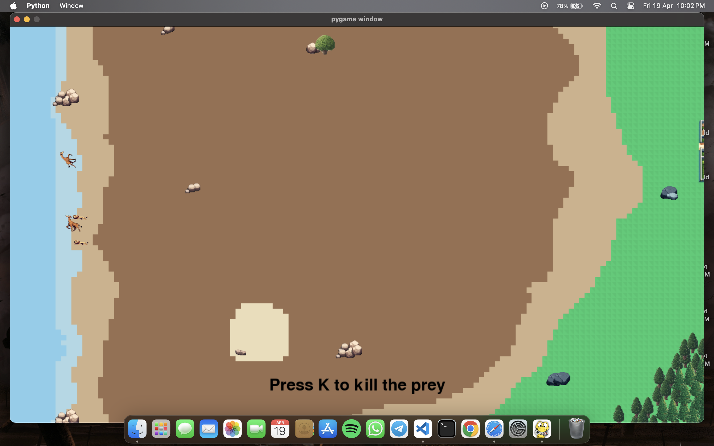
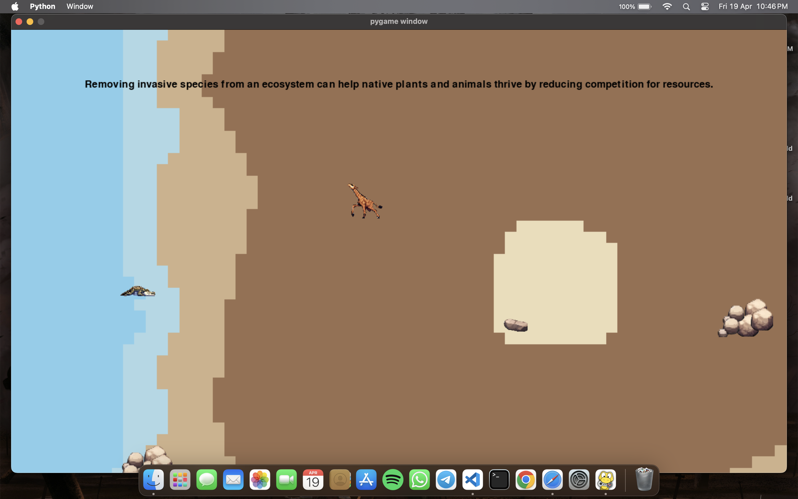

# COP290_Assignment_2

Course project - 2 for COP290 Design Practices, 4th semester IIT Delhi

This project is done by Shivam Sawarn(2022CS11075) and Yash bansal(2022CS51133)

## Ecoguard

This game is based on Wildlife reserves and its protection.

## Running

1.  To run the game, firstly we need to install the required dependencies for the game, namely pygame and pytmx. They can be installed using the following commands on the terminal :-

        pip3 install pygame

        pip3 install pytmx

2.  Then, download the zip file and unzip it. In the terminal, go to the respective folder and run
    the following commnand:-

        python3 game2.py

    This will run the game and open a seperate pygame window.

## Starting the game

The following is the start screen of the game.

   

Clicking on the play button would start the game. After starting, the user need to choose its character from the following screen.
   

<br<>  

## Playing the game

The game maps looks like the following.
   

   

   

   

On choosing the character, the user can move it using the WASD keys, respectively for up, left, down and right, and pressing the space key increases the speed of the character.

The motive of the game is to save the character, as well as keep atleast one prey and one predator in the wildlife reserve. If there are no preys or predators, the ecological balance of the reserve gets destroyed and the game is lost.

On regular intervals, Informations regarding wildlife reserve, good bio-diversity practises and other useful information keeps flashing on the screen for the benefit of user and social good.

   

   

1. The lion's motive is to be safe from the poacher and hunt preys for its food. To kill the prey, the user need to press C key to start the chase, and K key to kill when it is near its prey.

2. The giraffe need to be safe from the predators and the poacher. To run, pressing the space key can increase its speed, so that it can run from the hunters.

3. The poacher hunts the animals, and wants to remain safe from the rangers of the reserve.

4. The ranger need to protect the wildlife reserve and maintain its balance. It kills the poachers and thus, prevent them from hunting the animals.

The animals can hide from the hunters by running to the forest area, where they would be invisible to the hunters.

## Example gameplay :- lion's gameplay

1. When lion is near the prey, the user can press C to start the chase on the prey.

   

   

2. After starting the chase, when the lion is just near the prey, the user can press K to kill the prey.

   

   

3. The following is the image of a killed prey.

   

   

4. The following are images of the lion hiding behind the stones and the trees

   

   
   

   

5. If the lion goes to the river, the crocodile eats it and it dies.

   

   